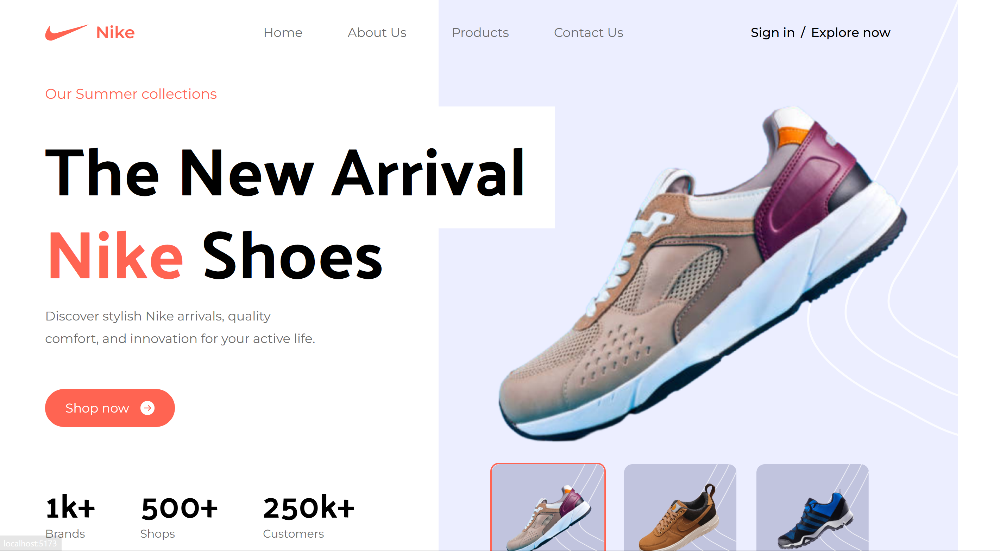

# Nike Landing Page

<div align="center">
  <br />
  <!-- Homepage Screenshot Placeholder -->
  
  <br />
  <br />
  
  <h3 align="center">Nike Landing Page - Built with React & Tailwind CSS</h3>
</div>

---

## 📋 Table of Contents

1. [Introduction](#introduction)
2. [Tech Stack](#tech-stack)
3. [Features](#features)
4. [Getting Started](#getting-started)
5. [Project Structure](#project-structure)

---

## Introduction

This project is a modern, responsive Nike landing page built with React.js and Tailwind CSS. It demonstrates advanced Tailwind techniques, reusable React components, and a clean, scalable code structure.

---

## Tech Stack

- **React.js** (Functional Components)
- **Tailwind CSS** (Utility-first CSS)
- **Vite** (Development/build tool)

---

## Features

- Responsive design for all devices
- Hero section with product highlights
- Popular products showcase
- About Us / Super Quality section
- Services overview
- Special offers
- Customer reviews/testimonials
- Newsletter subscription
- Footer with useful links and social media
- Clean, maintainable codebase

---

## Getting Started


### Installation

```sh
git clone https://github.com/your-username/nike-landing-page.git
cd nike-landing-page
npm install
```

### Running the Project

```sh
npm run dev
```

Open [http://localhost:5173](http://localhost:5173) in your browser to view the project.

### Building for Production

```sh
npm run build
```

---

## Project Structure

```
src/
  assets/         # Images and icons
  components/     # Reusable React components
  constants/      # Static data/constants
  sections/       # Page sections as components
  App.jsx         # Main app component
  main.jsx        # Entry point
  index.css       # Tailwind and global styles
public/
  favicon.ico
  vite.svg
index.html
...
```
